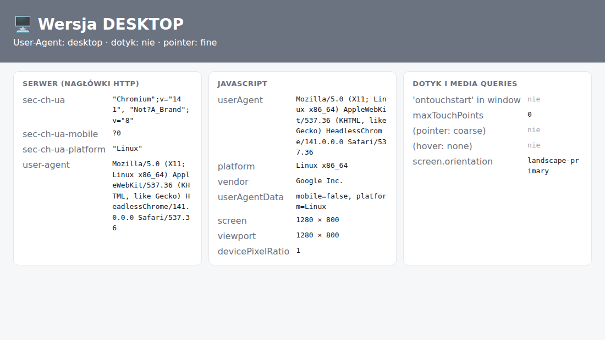
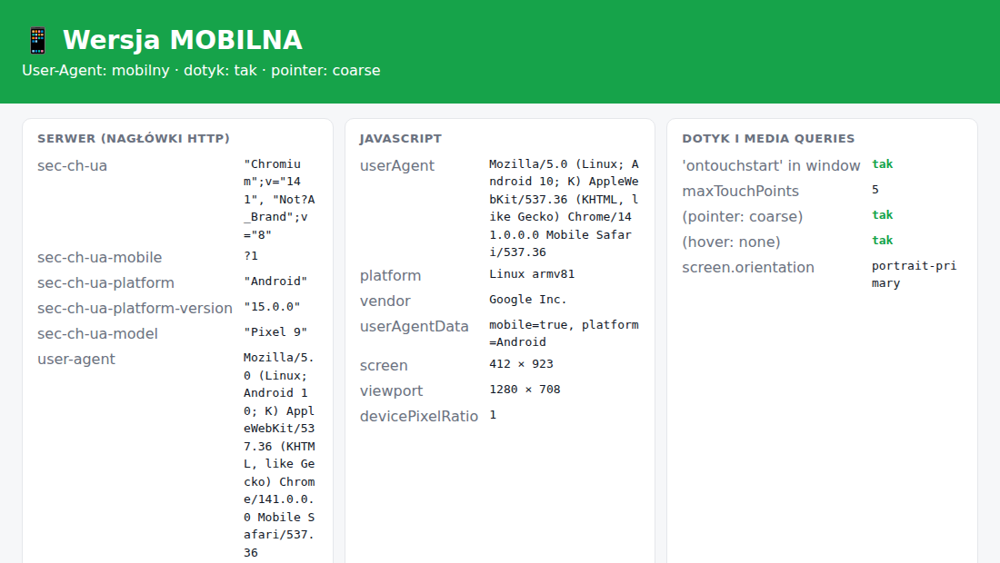
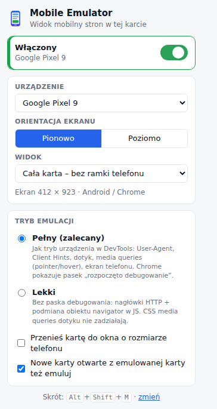

<div align="center">


# Mobile Emulator

**Wtyczka do Google Chrome, dzięki której strony w karcie myślą, że są otwarte na telefonie.**

Karta wygląda normalnie: nie ma ramki telefonu ani małego okienka. Strona dostaje User-Agent Androida albo iPhone'a, mobilne Client Hints, obsługę dotyku, `pointer: coarse` i wymiary ekranu telefonu. Dzięki temu serwuje wersję mobilną i odblokowuje funkcje dostępne tylko na urządzeniach mobilnych.

[](https://github.com/matmaxalez/mobilebrowser/actions/workflows/ci.yml)


</div>

| Wyłączona | Włączona (Google Pixel 9, widok „Cała karta”) |
|---|---|
|  |  |



## Funkcje

- **Włączasz jednym kliknięciem, osobno w każdej karcie.** Inne karty działają normalnie. Skrót klawiszowy to <kbd>Alt</kbd>+<kbd>Shift</kbd>+<kbd>M</kbd>.
- **Strona zajmuje całą kartę, bez ramki telefonu.** Strona widzi telefon, a Ty widzisz zwykłą kartę. Do wyboru są jeszcze dwa widoki: szerokość telefonu rozciągnięta na kartę albo dokładny rozmiar 1:1.
- **Emulacja obejmuje wszystko, po czym strony rozpoznają telefon:**
  - nagłówek `User-Agent` i `navigator.userAgent`;
  - Client Hints: `Sec-CH-UA-Mobile: ?1`, `Sec-CH-UA-Platform: "Android"`, model i wersja systemu;
  - `navigator.userAgentData` (w profilach iOS go nie ma, tak jak w Safari);
  - dotyk: `ontouchstart`, `maxTouchPoints = 5`, zdarzenia `touch*` z myszy;
  - media queries `(pointer: coarse)` i `(hover: none)`, także w CSS;
  - `screen.width/height` i orientacja ekranu.
- **Gotowe profile urządzeń:** Pixel 9 i 8, Galaxy S24, S24 Ultra i A55, iPhone 16 Pro, 16 Pro Max, 15 i SE, iPad Mini, Galaxy Tab S9. Możesz też dodać własne urządzenie z własnym UA.
- **UA Androida ma zawsze numer Twojej wersji Chrome**, więc strony sprawdzające wersję przeglądarki działają poprawnie.
- **Nowe karty otwarte z emulowanej karty są emulowane automatycznie.** Dotyczy to `target=_blank` i `window.open`.
- **Tryb „Lekki” działa bez paska debugowania.** Szczegóły są niżej w sekcji o trybach.
- **Wtyczka nie zbiera żadnych danych**, niczego nie wysyła i działa w całości lokalnie ([PRIVACY.md](PRIVACY.md)).

<br clear="right">

## Instalacja

### Z gotowej paczki (najprościej)

1. Pobierz `mobile-emulator-v*.zip` z zakładki [**Releases**](https://github.com/matmaxalez/mobilebrowser/releases).
   Jeśli nie ma jeszcze wydania, kliknij na tej stronie **Code → Download ZIP** i użyj folderu `extension/`.
2. Rozpakuj archiwum do stałego folderu. Nie usuwaj go później, bo Chrome wczytuje wtyczkę właśnie z niego.
3. Wejdź na `chrome://extensions`.
4. Włącz przełącznik **Tryb dewelopera** w prawym górnym rogu.
5. Kliknij **Załaduj rozpakowane** i wskaż rozpakowany folder, czyli ten, w którym jest `manifest.json`.
6. Przypnij ikonę telefonu do paska narzędzi (ikona puzzla → pinezka).

Wtyczka działa też w innych przeglądarkach opartych na Chromium: Edge, Brave, Opera i Vivaldi.

### Z kodu źródłowego

```bash
git clone https://github.com/matmaxalez/mobilebrowser.git
cd mobilebrowser
npm install        # potrzebne tylko do testów i budowania
npm run build      # tworzy dist/mobile-emulator-v<wersja>.zip
```

Możesz też załadować folder `extension/` bezpośrednio jako rozpakowaną wtyczkę.

## Użycie

1. Otwórz dowolną stronę.
2. Kliknij ikonę wtyczki i włącz przełącznik albo naciśnij <kbd>Alt</kbd>+<kbd>Shift</kbd>+<kbd>M</kbd>.
3. Karta się przeładuje i strona wyświetli się w wersji mobilnej. Na ikonie pojawi się plakietka **ON**.
4. Żeby wyłączyć emulację, kliknij przełącznik jeszcze raz.

Zmiana urządzenia, orientacji albo widoku działa od razu w aktywnej karcie.

### Tryby emulacji

| | **Pełny** (domyślny, zalecany) | **Lekki** |
|---|---|---|
| Technika | `chrome.debugger` + Chrome DevTools Protocol, czyli to samo co tryb urządzenia w DevTools | reguły `declarativeNetRequest` + skrypt w świecie MAIN przy `document_start` |
| User-Agent i Client Hints (HTTP) | ✅ | ✅ |
| `navigator.*`, `userAgentData`, `screen` | ✅ | ✅ |
| Dotyk (`ontouchstart`, `maxTouchPoints`) | ✅ prawdziwe zdarzenia dotyku | ✅ tylko wykrywanie |
| `(pointer: coarse)` w **CSS** | ✅ | ❌ (działa tylko przez `matchMedia` w JS) |
| Pasek „…rozpoczęło debugowanie tej przeglądarki” | widoczny | brak |

W trybie **pełnym** Chrome pokazuje u góry żółty pasek informacyjny. Wymaga tego Chrome i żadna wtyczka nie może go ukryć. Jeśli klikniesz na nim **Anuluj**, emulacja wyłączy się we wszystkich kartach.

### Widoki (tryb pełny)

- **Cała karta – bez ramki telefonu** (domyślny): strona renderuje się w pełnym rozmiarze karty, a jako telefon przedstawia ją tylko to, co widzi (UA, dotyk, ekran). Ten widok przydaje się, gdy strona rozpoznaje telefon po UA, a nie po szerokości okna.
- **Szerokość telefonu, rozciągnięta na kartę:** strona dostaje szerokość telefonu (np. 412 px) i jest powiększona do szerokości karty. Pokazuje mobilny układ stron responsywnych na całej karcie.
- **Dokładny rozmiar telefonu (1:1):** klasyczny tryb urządzenia z dokładnym viewportem i DPR telefonu.

## Sprawdzenie działania

W repozytorium jest strona testowa, która pokazuje, co widzi strona internetowa:

```bash
npm run demo    # → http://127.0.0.1:8787/detect
```

Otwórz ją, włącz wtyczkę i sprawdź, czy nagłówek zmienia się z „🖥️ Wersja DESKTOP” na „📱 Wersja MOBILNA”.

## Ograniczenia

- Nie da się emulować stron wewnętrznych Chrome (`chrome://…`) ani Chrome Web Store. Tak działa Chrome.
- Strony, które rozpoznają urządzenie tylko po szerokości okna, pokażą układ mobilny dopiero w widoku „rozciągnięta” albo „1:1”.
- Tryb lekki podmienia właściwości w JS. Zaawansowane skrypty antyfraudowe mogą to wykryć. Tryb pełny działa na poziomie silnika przeglądarki.
- W trybie lekkim zapytania wysyłane przez service worker strony (np. w aplikacjach PWA) nie przechodzą przez reguły karty. Pełny tryb nie ma tego problemu.
- Emulacja nie zmienia adresu IP, lokalizacji ani odcisku sprzętowego (WebGL, czcionki).

## Rozwój

```bash
npm install
npm run lint          # ESLint
npm test              # testy E2E: prawdziwy Chromium + wtyczka (Playwright)
npm run build         # paczka ZIP w dist/
npm run screenshots   # odświeża zrzuty w docs/img/
npm run icons         # generuje ikony PNG
```

Strukturę projektu i konwencje opisuje [CLAUDE.md](CLAUDE.md). Research i decyzje techniczne są w [docs/RESEARCH.md](docs/RESEARCH.md).

Nowa wersja: podbij `version` w `extension/manifest.json` i `package.json` i dopisz zmiany do [CHANGELOG.md](CHANGELOG.md). Potem wypchnij tag (`git tag v1.2.3 && git push --tags`) albo uruchom ręcznie workflow **Actions → Release → Run workflow**. GitHub Actions zbuduje ZIP i opublikuje go jako Release.

## Licencja

[MIT](LICENSE)
